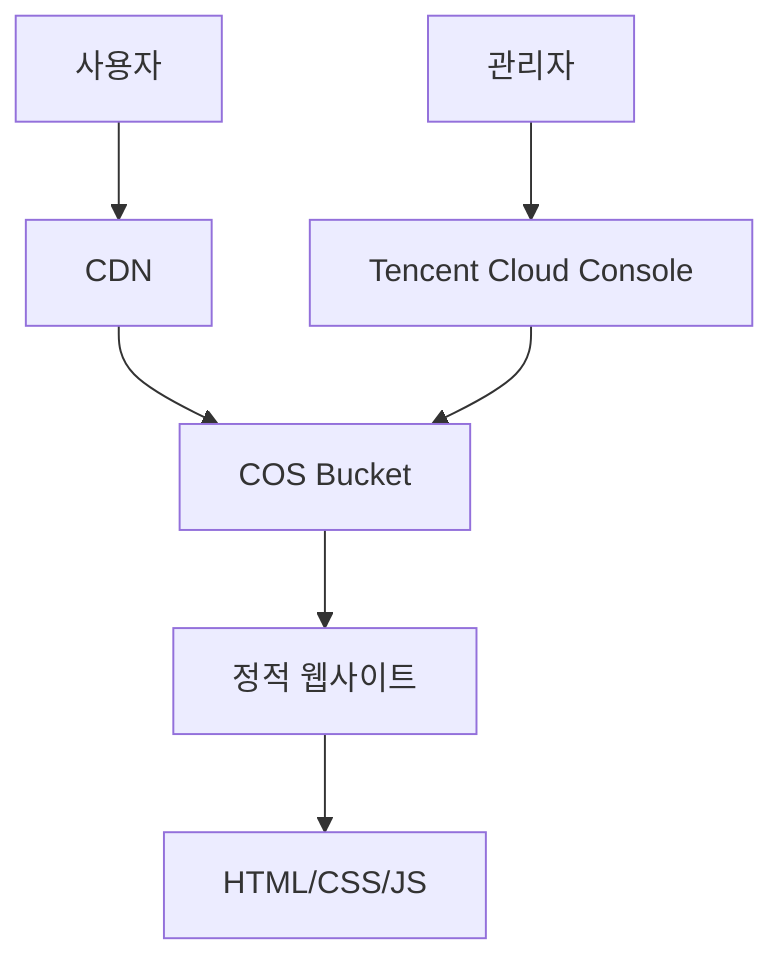

# Tencent Cloud PoC 가이드 개요

## 소개

Tencent Cloud PoC 가이드에 오신 것을 환영합니다. 이 가이드는 Tencent Cloud 서비스를 활용하여 Proof of Concept (PoC) 프로젝트를 성공적으로 구현하는 방법을 단계별로 안내합니다.

## 주요 특징

### 🚀 빠른 시작
- 간단한 설정으로 바로 시작할 수 있습니다
- 단계별 가이드로 누구나 쉽게 따라할 수 있습니다

### ☁️ 클라우드 네이티브
- Tencent Cloud의 최신 서비스를 활용합니다
- 확장 가능하고 안정적인 아키텍처를 제공합니다

### 🔧 개발자 친화적
- 개발자를 위한 상세한 기술 문서를 제공합니다
- 코드 예제와 실제 구현 사례를 포함합니다

## 아키텍처 개요

## 지원하는 서비스

| 서비스 | 설명 | 사용 목적 |
|--------|------|-----------|
| **COS** | Object Storage Service | 정적 파일 호스팅 |
| **CDN** | Content Delivery Network | 전역 가속 및 캐싱 |
| **CVM** | Cloud Virtual Machine | 백엔드 서비스 (선택사항) |
| **CLB** | Cloud Load Balancer | 로드 밸런싱 (선택사항) |

## 시작하기 전에

### 필수 요구사항

- [ ] Tencent Cloud 계정
- [ ] COS 버킷 생성 완료
- [ ] CDN 도메인 설정 완료
- [ ] 기본적인 웹 개발 지식

### 권장 사항

- [ ] Git 버전 관리 시스템
- [ ] 코드 에디터 (VS Code, Sublime Text 등)
- [ ] 웹 브라우저 (Chrome, Firefox, Safari 등)

## 빠른 시작

1. **환경 설정** - 개발 환경을 준비합니다
2. **COS 설정** - Object Storage를 구성합니다
3. **정적 호스팅** - 웹사이트를 배포합니다
4. **CDN 설정** - 성능을 최적화합니다

## 다음 단계

이 가이드를 따라하면서 다음과 같은 내용을 학습할 수 있습니다:

- Tencent Cloud COS의 기본 사용법
- 정적 웹사이트 호스팅 설정
- CDN을 통한 성능 최적화
- 보안 설정 및 모니터링
- 문제 해결 및 디버깅

## 도움말

문제가 발생하거나 추가 도움이 필요한 경우:

- [자주 묻는 질문](./faq.md) 페이지를 확인하세요
- [문제 해결](./troubleshooting.md) 가이드를 참조하세요
- Tencent Cloud 공식 문서를 참조하세요

---

**참고**: 이 가이드는 Tencent Cloud의 최신 서비스를 기반으로 작성되었습니다. 서비스 업데이트에 따라 일부 내용이 변경될 수 있습니다. 